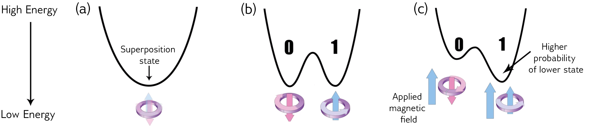
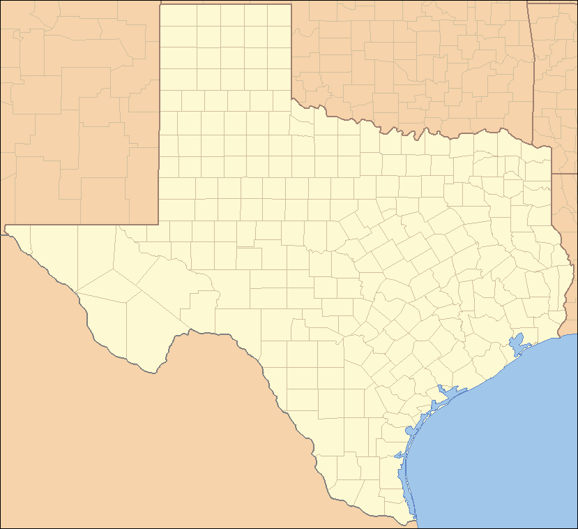
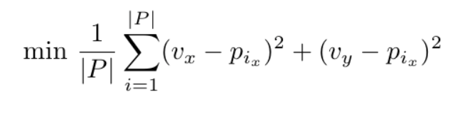
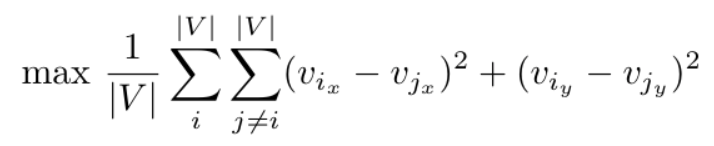
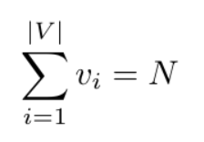
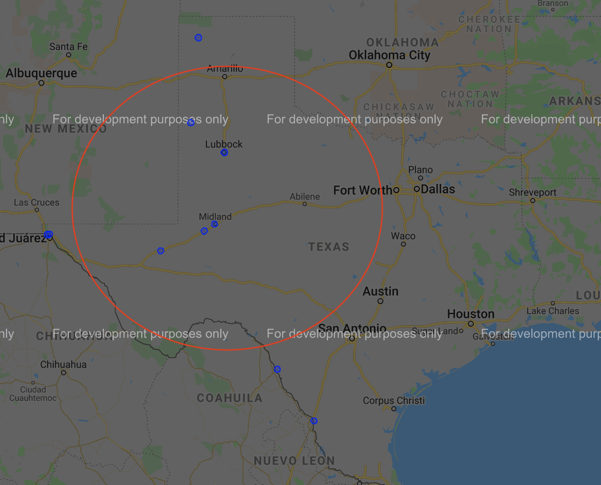
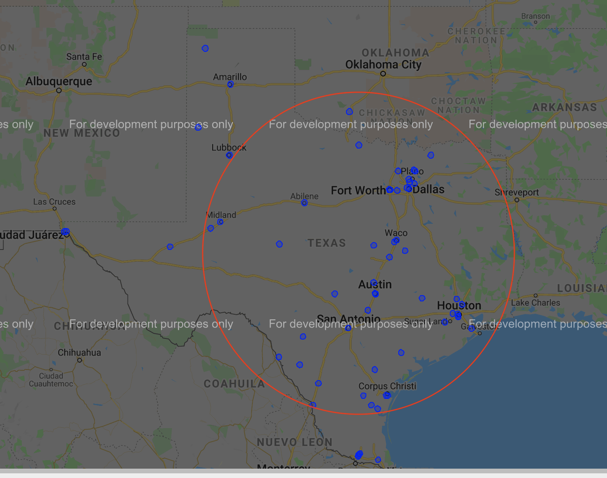
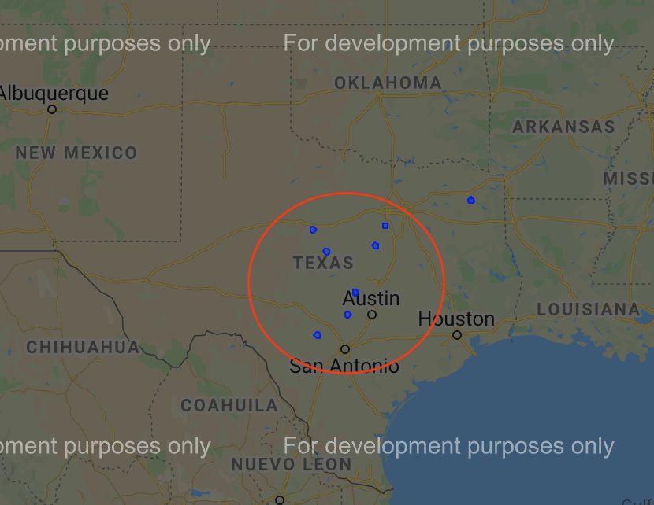
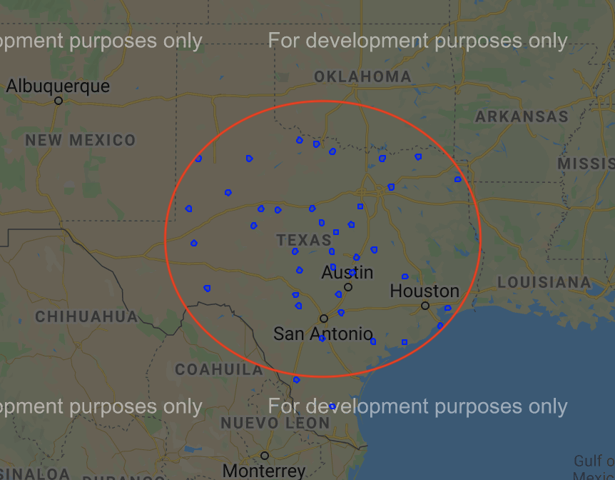
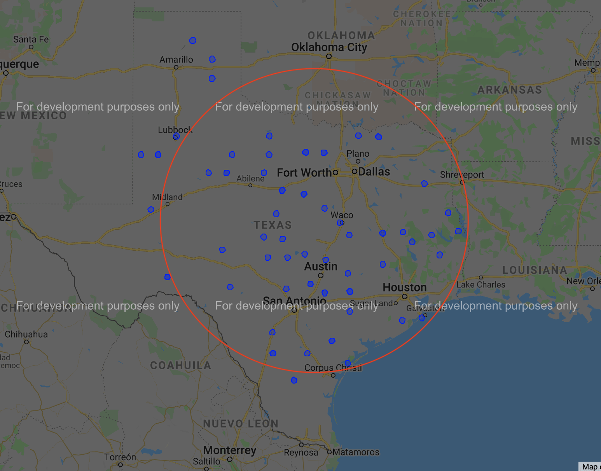

This IAP, Shreya, Elaine, and I decided to take 6.s089 Introduction to Quantum Computing. We struggled with psets and consuming content together each week, and our month culminated in the completion of our iQuHack project, *Optimizing COVID-19 Vaccine Distribution with Quantum Annealing*.  

To provide some context, [iQuHack](https://www.iquise.mit.edu/iQuHACK/) is MIT’s annual quantum computing hackathon. We were both excited and scared for the event, as our monthlong journey into quantum computing was put to the test.  

A little more than a week before the event, we found out that we were placed in the quantum annealing division. Despite having consumed 16 hours of lecture content, none of us had any idea what quantum annealing was. After some Google searches, we learned that quantum annealing uses qubit states to find the global minimum of a function. In other words, quantum annealing is a **powerful optimization tool**.  

### A note on quantum annealing
Consider the function *y=x²*. Based on its graph, we can see that the lowest point on the graph occurs at *x=0*. This is known as the global minimum.  

Classically in mathematics, the global minimum can be found using Langrangian multipliers or a series of derivatives. Algorithmically, linear programming, a method that uses mathematical modelling to optimize an objective function, can solve for a global minimum.  

In the quantum realm, these mathematical optimizations are quite similar. However to solve these optimization problems, quantum annealing harnesses physical properties of qubits to identify the global minimum. In physical models, systems always converge to a low-energy state. For example, water always flows downhill and batteries always tends toward equilibrium (the electric potential difference between the electrodes reaches 0). Quantum annealing uses quantum bits, known as qubits, to model these energy states. During quantum annealing, qubits alternate between a 0 and 1 state, and when the process ends, assuming there are no other external forces, the qubit has an equal probability of being in either state. Once a varying magnetic field is applied to the qubits, some qubit states’ energies fall below others and a probability distribution emerges. Quantum annealing thus chooses the lowest energy qubit state with the help of these *biases* toward certain states.  

Despite the complex hardware behind the process, the input to the system is known as a quadratic unconstrained binary optimization, or QUBO. They represent constraints for the variables in the problem.

---

## Pre-hackathon preparations

Our team met up the weekend before the hackathon to brainstorm potential ideas. All of us had taken an algorithms class before, and we quickly related the QUBO functions to concepts and problems we had encountered in class. Some ideas that arose was optimizing class scheduling at MIT, musical note recognition, and hospital resource utilization. We decided to take on the latter, but after a literature review, realized that the data was too hard to find and that another group of researchers had already published their [findings](https://www.nature.com/articles/s41598-019-49172-3) on the topic.  

As a result, we settled on another related but more relevant topic — ***vaccine distribution***.

---

For the past month, the global COVID-19 vaccine distributions have been heavily scrutinized by the media. In particular in the US, the government’s vaccine rollout plan has been extremely fragmented and virtually nonexistent. Furthermore, many of the vaccines that do reach their distribution centers are discarded because of contamination or expiration (vaccines are effective for only 10 days after).  

> To address these issues, we decided to minimize the average distance that at-risk individuals needed to travel to reach a vaccine distribution site.

First up was the problem of collecting our data. Who is an at-risk individual? What geographic area should we cover with our project? What is the scale of our project?  

After much research on the available data, we defined the following. An at-risk individual was an individual over the age of 65. We would focus our algorithm on the state of Texas, mostly because it’s health department had the data we needed and because it covers a geographically large area and contains both rural and urban centers. Finally, we chose to analyze our data at the county level. A section on limitations of these parameters is included at the end of this article.

  

We modeled our problem as such. Each county of Texas would be a node *p* on a graph *G*. Each *p* would also hold location data, which we defined in longitude-latitude coordinates based on the geographical center of the county. We also found the location data on currently authorized vaccine distribution centers in Texas, which we call nodes *v*. We then defined some constraints:

1. Minimize the distance between a vaccine distribution center *v_i* and each county *p_i*. We calculated the distance in miles between latitude-longitude coordinates using the Manhattan distance.  

2. Maximize the distance between each v_i, v_j for i != j. In other words, make sure that vaccine distribution centers are far apart from one another.  

3. Place exactly N vaccine distribution centers.  

Here’s a visualization of our results. 

<em>N=10</em>

<em>N=40</em>

<em>N=70</em>

From the results, we can see when *N=10*, the vaccine centers tend to be distributed on the western border of Texas. This makes sense as our second constraint encourages placement of sites farther away from each other. As *N* increases, sites begin to be more concentrated in the center and south of Texas. In these scenarios, the maximum distance between two sites will be much smaller than before, so there is a greater preference for sites to be placed in the center of the state.

To explore some more, we reran the algorithm on different variations of the problem. In the case, we can freely choose vaccine distribution centers, rather than confine them to the list of sites Texas’ health department website lists. We also decided to remove constraint 2 so that sites can be placed closed together. We then chose county centers as both nodes *p* and *v*.  

<em>N=10</em>

<em>N=40</em>

<em>N=70</em>

In contrast to the previous results, we noticed that at a small *N*, the sites were concentrated in the center of the state and that as *N* grew, the sites grew outward radially as well. We predicted this to happen, as more counties are concentrated in the center of Texas. For example at the border counties, other counties (nodes) are found on only one side of the county. Therefore, pressure is smaller for border counties, favoring the center of the state instead.

## Limitations

We made several assumptions in our model:
* Individuals will have access to transportation
* Distribution centers have unlimited vaccine capacity
* Populations are concentrated at the geographical center of the counties
* Vaccines will be [shipped directly](https://www.pfizer.com/news/hot-topics/covid_19_vaccine_u_s_distribution_fact_sheet) to distribution centers
* All counties are weighted equally.
* Points are on a 2D plane rather than a sphere.

In addition to these assumptions, we did not take into account dosage differences, dosage timings, nor the capacity of each distribution center.

## Future work
Currently, our project only minimizes the average distance from all nodes to a certain vaccine distribution center. There are some obvious flaws in this constraint. For example, why would a resident of south Texas care about the distance to a distribution center near Oklahoma?   

Therefore, we believe an improved QUBO would instead minimize the distance from a county *p_i* to the closest vaccine distribution site *v’_i*.  

Furthermore, we believe weighting our QUBOs by population as well as distance would increase the accuracy of our results. Dallas County, with a population of 2.6 million for example, would require more distribution sites than Martin County, which has a population of 5,600. One method of achieving this is by expanding on the second variation of our algorithm and multiplying distances in our QUBOs by population of that county.  

To be even more specific on site placement, we could run our algorithm on zipcode-level data and use the [great circle distance](https://mathworld.wolfram.com/GreatCircle.html) instead of Manhattan distance. Finally, we could broaden our definition of at-risk populations by also accounting for individuals with chronic and respiratory diseases.

## Conclusions
This weekend, we spent close to 24 hours on this project, without counting the brainstorming and data collecting time we spent the previous weekend. All of us entered the hackathon with minimal to no quantum computing experience, and we struggled to formulate our QUBOs and format our data.  

Overall though, we’re all grateful for the learning experience and the advanced hardware that could have helped us on our 6.046 psets. We would love to build on this project in the future using some ideas listed under the future work section above. Special thanks to Amir and Joel for helping us during the month and during the hackathon.  

---

[Here's](https://github.com/iQuHACK/2021_1206) a link to our project's Github repo. I originally wrote this in [Medium](https://medium.com/mit-6-s089-intro-to-quantum-computing/optimizing-covid-19-vaccine-distribution-using-quantum-annealing-b1b829d97784) for an assignment.

## References
- [ev-charger-placement][1]
- [County Locations (TX)][2]
- [Distribution centers in TX][3]
- [Percentage of population 65+ in TX][4]

[1]: https://github.com/dwave-examples/ev-charger-placement
[2]: https://en.wikipedia.org/wiki/User:Michael_J/County_table
[3]: https://tdem.maps.arcgis.com/apps/webappviewer/index.html?id=3700a84845c5470cb0dc3ddace5c376b
[4]: https://www.indexmundi.com/facts/united-states/quick-facts/texas/percent-of-population-65-and-over#table